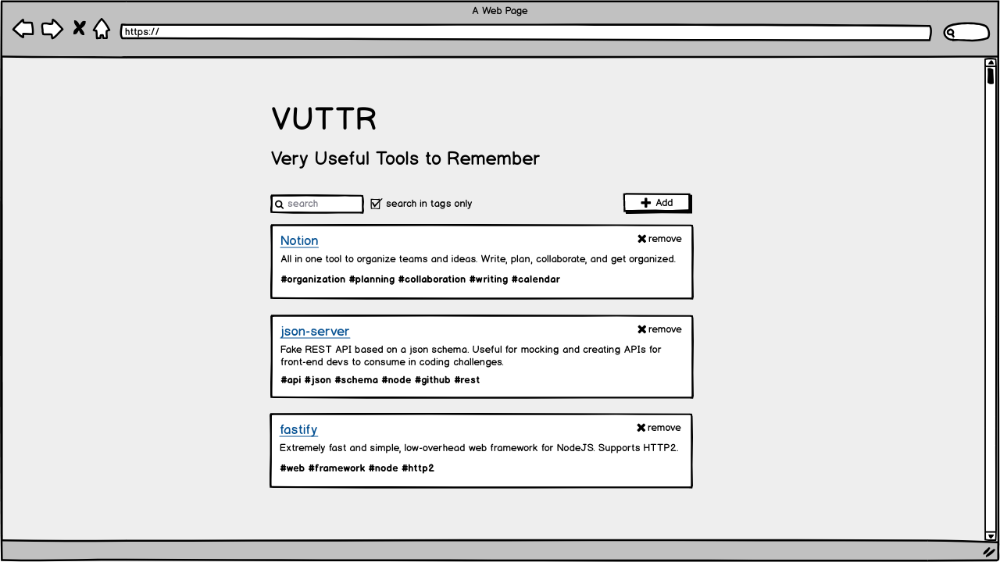
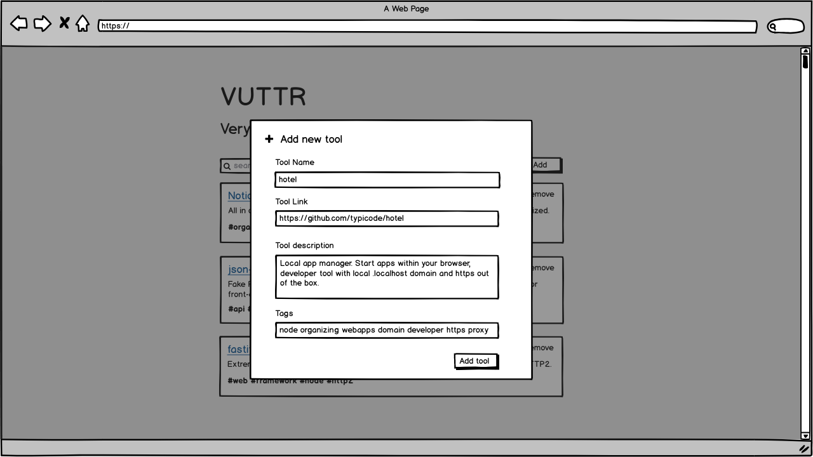
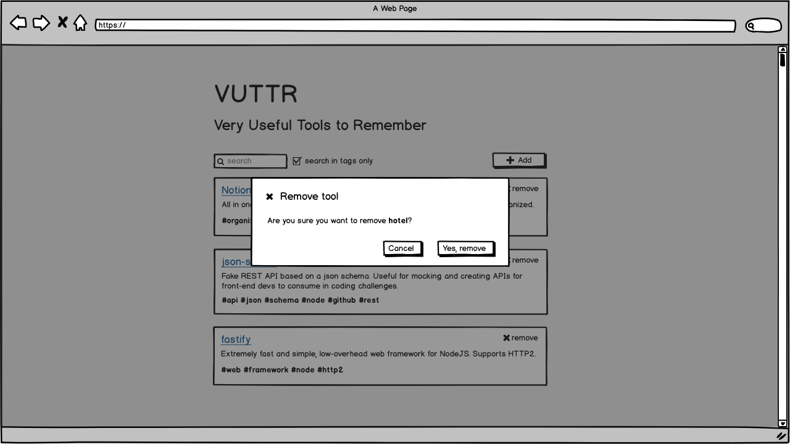
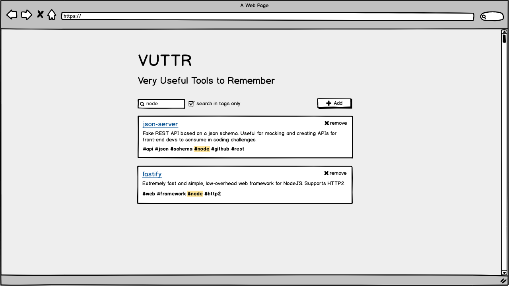

# FRONTEND - Teste

#### Sua tarefa é construir um front-end para a aplicação VUTTR (Very Useful Tools to Remember). A aplicação é um simples repositório para gerenciar ferramentas com seus respectivos nomes, links, descrições e tags. Utilize um repositório Git (público, de preferência) para versionamento e disponibilização do código.

#### O front-end deve ser construído utilizando framework JavaScript React de preferência, seguindo os wireframes apresentados abaixo. Pode ser React, porém gostaríamos de ver suas habilidades em React-Native.

#### O que será avaliado:

**Queremos avaliar sua capacidade de desenvolver e documentar um front-end para uma aplicação com back-end pronto.** Serão avaliados:

- Código bem escrito e limpo;
- Quais ferramentas foram usadas, como e por quê;
- Seu conhecimento em JavaScript, HTML e CSS;
- Sua capacidade de se comprometer com o que foi fornecido (wireframe, styleguide);
- Sua capacidade de documentação da sua parte da aplicação.
- O mínimo necessário
- As telas seguindo os wireframes a seguir e utilizando um mockAPI ou a API criada para o teste de backend(se está concorrendo também!);
- README.md contendo informações básicas do projeto e como executá-lo.

#### Bônus

Os pontos a seguir se destacam como características para se destacar.

- Testes de front-end;
- Uso de ferramentas externas que facilitem o seu trabalho;
- Cuidados especiais com otimização, SEO, entre outros;
- Deploy da aplicação utilizando ferramentas externas (Netlify, Surge, S3, Firebase, etc);
- Pipeline de deploy contínuo
- Sugestões sobre o challenge embasadas em alguma argumentação.
- User Stories e wireframes

1. O(A) usuário(a) deve poder ver a lista de todas as ferramentas cadastradas

2. O usuário deve poder adicionar uma nova ferramenta

3. O usuário deve poder remover uma ferramenta

4. O usuário deve poder buscar ferramentas dinamicamente (global ou utilizando apenas tags)

#### Critérios de Aceitação

- Todos os requisitos acima devem ser cumpridos, seguindo o padrão estabelecido;
- Se você julgar necessário, adequado ou quiser deixar a aplicação mais completa (bônus!) você pode adicionar outras funcionalidades, métodos, etc.

Bom trabalho!

API

Utilize um mockAPI para disponibilizar os dados para você! 
